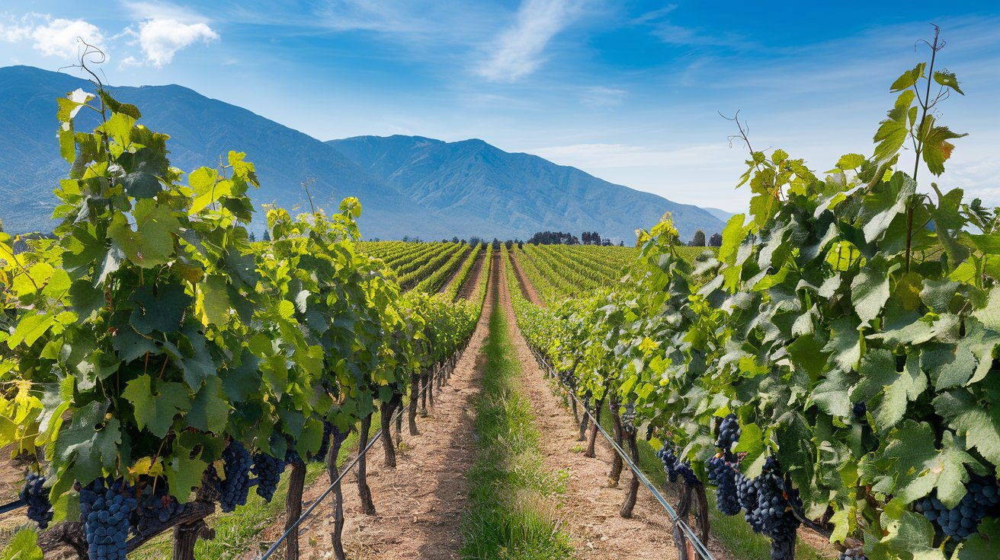
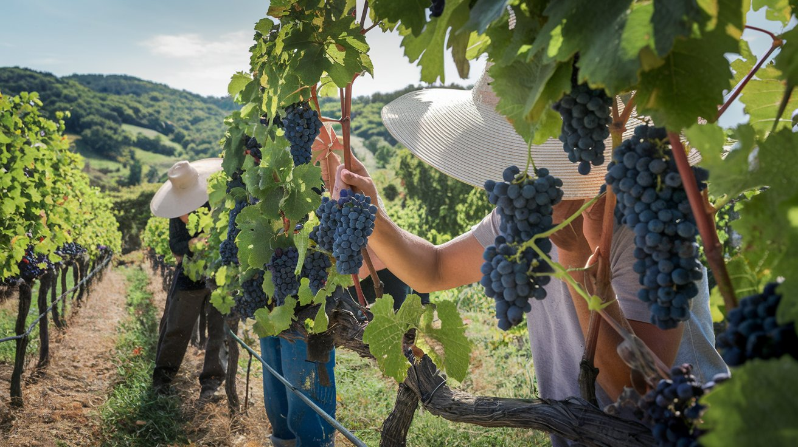
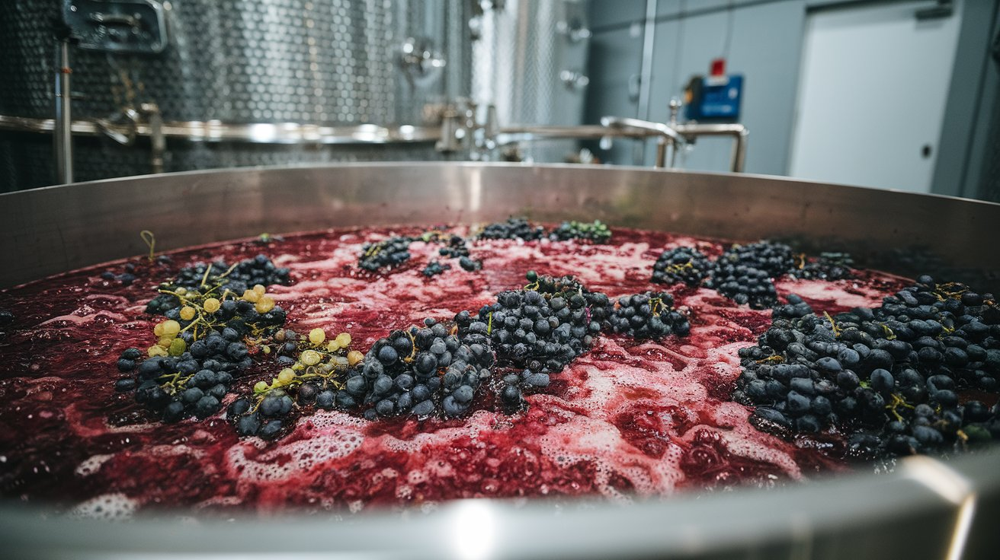
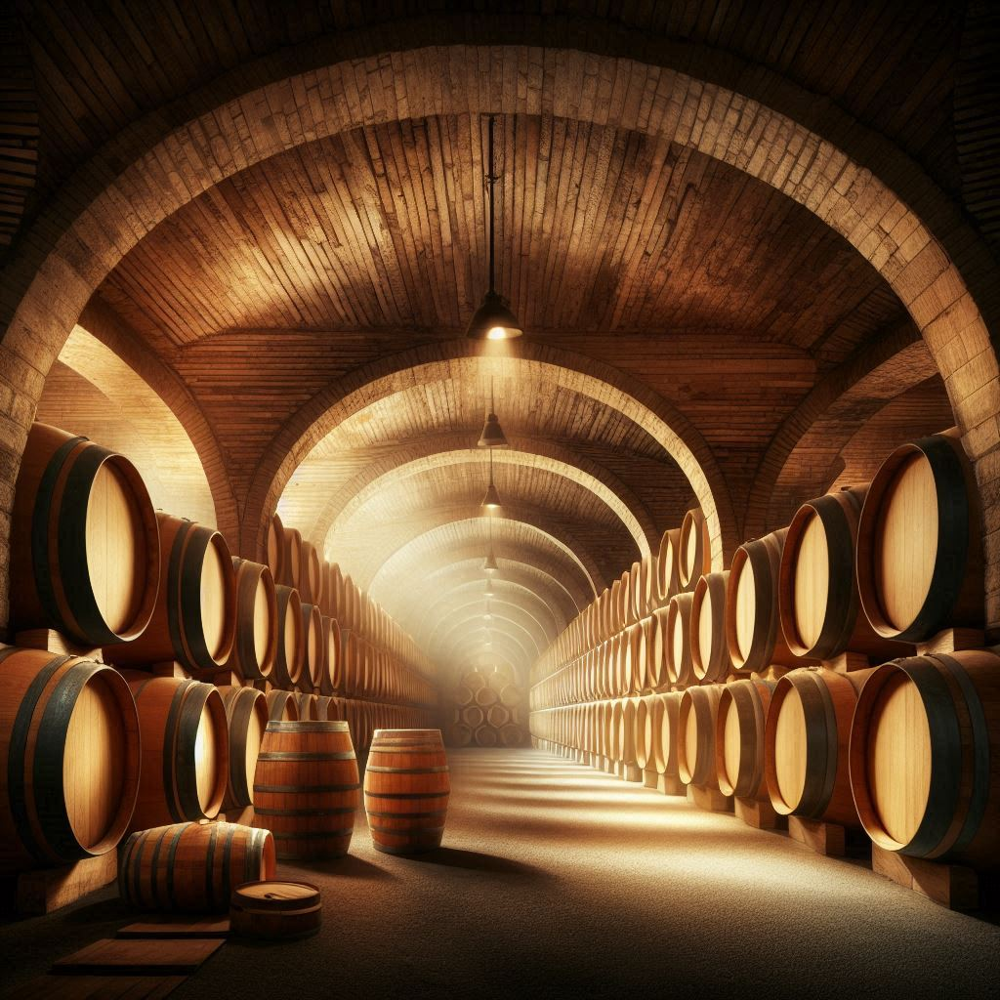
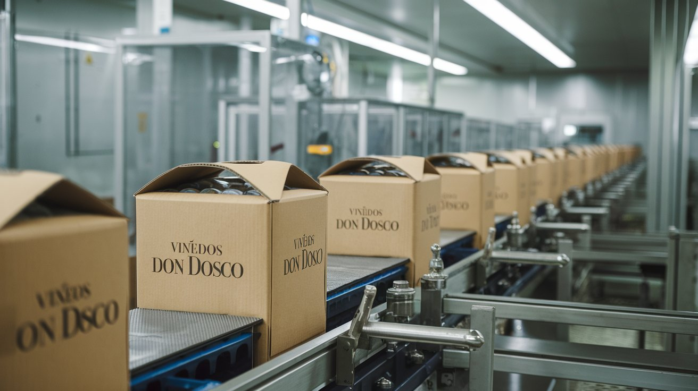
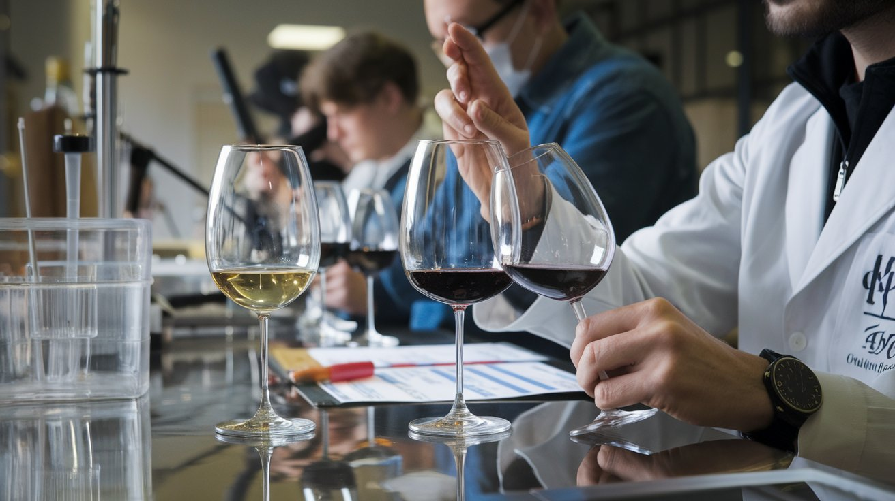
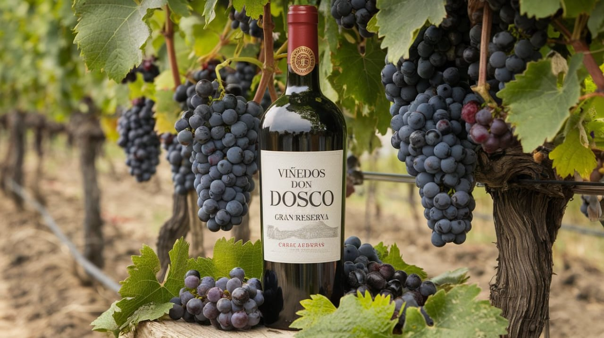

<!DOCTYPE html>
<html lang="es">
<head>
    <meta charset="UTF-8">
    <meta name="viewport" content="width=device-width, initial-scale=1.0">
    <title>Viñedos Don Dosco</title>
    <link rel="stylesheet" href="styles.css">
    
</head>
<body>
    <header>
        <h1>Viñedos Don Dosco</h1>
        <nav>
            <a href="#introduccion">Introducción</a>
            <a href="#produccion">Producción</a>
            <a href="#envasado">Envasado</a>
            <a href="#calidad">Control de Calidad</a>
            <a href="#contacto">Contacto</a>
        </nav>
    </header>

    

        <section id="introduccion" class="section">
            <h2>Introducción</h2>
            

                
            

            

                Viñedos Don Dosco está ubicado en la hermosa Cordillera de los Andes, donde las condiciones climáticas son ideales para el cultivo de uvas de alta calidad. Nuestra pasión por el vino se refleja en cada botella que producimos, utilizando técnicas tradicionales y modernas para ofrecer un producto excepcional.
            

        </section>

        <section id="produccion" class="section">
            <h2>Proceso de Producción</h2>
            

                
                
                
            

            

                El proceso de producción comienza con la cosecha manual de uvas, seguida de la fermentación en tanques de acero inoxidable. Cada etapa es supervisada cuidadosamente para garantizar la calidad del vino.
            

        </section>

        <section id="envasado" class="section">
            <h2>Envasado y Distribución</h2>
            

                
            

            

                El vino se envasa en cajas tipo tetrabrik, manteniendo la frescura y calidad del producto. Esta elección de envasado es práctica y sostenible, facilitando su distribución.
            

        </section>

        <section id="calidad" class="section">
            <h2>Control de Calidad</h2>
            

                
            

            

                En nuestro laboratorio, cada lote de vino es sometido a pruebas rigurosas de calidad. Nos aseguramos de que cada botella cumpla con los estándares más altos.
            

        </section>

        <section id="contacto" class="section">
            <h2>Contacto</h2>
            

                
            

            

                Para más información, preguntas o pedidos, no dudes en contactarnos a través del siguiente formulario:
            

            <form id="contactForm">
                <input type="text" id="name" placeholder="Tu nombre" required>
                <input type="email" id="email" placeholder="Tu correo" required>
                <textarea id="message" rows="5" placeholder="Tu mensaje" required></textarea>
                <button type="submit">Enviar</button>
            </form>
        </section>
    

    <footer>
        
&copy; 2024 Viñedos Don Dosco. Todos los derechos reservados.

    </footer>

    
    
</body>
</html>
